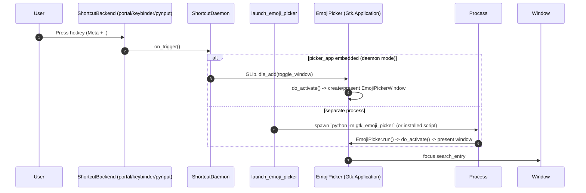
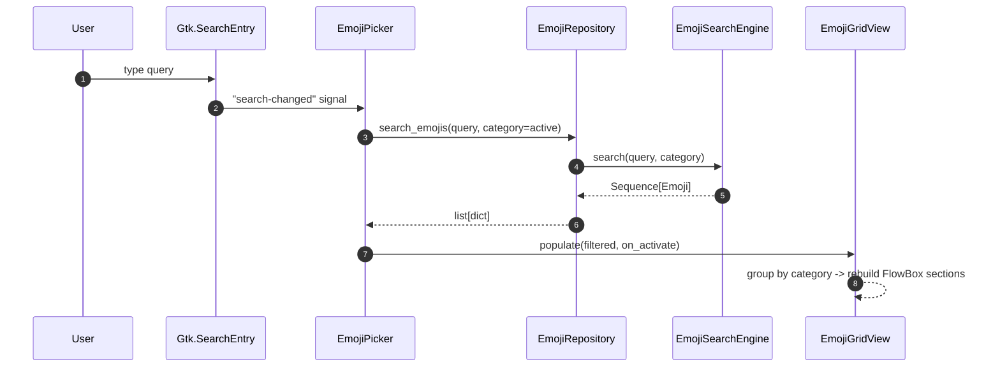

# GTK Emoji Picker — Architecture & Module Blueprint

- Status: baseline spec (implementation may lag this document during migration)
- Scope: high-level architecture, module boundaries, directory structure, signal/event flows, and tooling standards
- Applies to: GTK4 + Python 3.11+ emoji picker desktop utility

---

## 1. Architectural Objectives

1. Keep GTK4 UI code importable independently from optional global-shortcut backends.
2. Separate pure-Python domain/logic from OS-level GTK/X11/Wayland infrastructure.
3. Provide clean seams for the four domain modules:
   - **UI** (GTK4 widgets & window)
   - **IPC / Global Shortcut** (hotkey daemon + launcher)
   - **Emoji Data Provider** (data loading + search/indexing)
   - **Clipboard Manager** (clipboard write + auto-paste injection)
4. Enable strict type checking and linting on stable modules without being blocked by GTK stub quality.

## 2. Module Blueprint

### 2.1 Directory Structure

```text
gtk-emoji-picker/
├── pyproject.toml                  # source of truth: build, deps, ruff, black, mypy, pytest
├── .flake8                         # transitional flake8 config (ruff is primary)
├── setup.py                        # minimal setuptools shim
├── requirements.txt                # local bootstrap convenience file only
├── install.sh / uninstall.sh       # desktop integration / systemd daemon install
├── data/
│   ├── gtk-emoji-picker.desktop
│   └── gtk-emoji-picker-daemon.service
├── docs/
│   └── architecture.md             # this document
├── tests/                          # pytest suite (pytest.ini_options in pyproject.toml)
└── src/gtk_emoji_picker/
    ├── __init__.py                 # package metadata
    ├── __main__.py                 # python -m gtk_emoji_picker entry point
    ├── domain/                     # pure-python value objects & protocols (no gi/gtk)
    │   ├── models.py               # Emoji dataclass + EmojiProvider/EmojiRepository/
    │   │                           # EmojiCatalog/ClipboardPort/ShortcutBackend protocols
    ├── services/                   # use-case coordination over domain protocols
    │   ├── emoji_search_engine.py  # indexed search (tokens, categories, scoring)
    │   └── emoji_catalog.py        # catalog bridge repository -> search
    ├── gui/                        # UI module (GTK4 only)
    │   ├── window.py               # EmojiPickerWindow (Gtk.ApplicationWindow)
    │   ├── grid_view.py            # EmojiGridView (category-sectioned FlowBox grids)
    │   ├── category_bar.py         # CategoryBar (horizontal category switcher)
    │   └── css.py                  # application CSS provider
    ├── infrastructure/             # adapters to external systems
    │   ├── clipboard.py            # ClipboardManager: ClipboardService + AutoPasteService
    │   ├── emoji_provider.py       # JSON/in-memory/dict emoji data providers
    │   ├── shortcut_daemon.py      # daemon choosing & running a shortcut backend
    │   └── shortcut_backends/      # pluggable global-hotkey backends
    │       ├── base.py             # BaseShortcutListener ABC
    │       ├── portal.py           # XDG Desktop Portal (Wayland/X11)
    │       ├── keybinder.py        # keybinder-based (X11)
    │       └── pynput_backend.py   # pynput GlobalHotKeys fallback
    └── resources/
        └── emojis.json             # packaged starter dataset
```

Legacy root scripts (`emoji_picker.py`, `emoji_repository.py`, `hotkey_service.py`) remain as compatibility entrypoints only; new code should live in `src/gtk_emoji_picker/`.

### 2.2 Module Map

| Domain module | Canonical location | Responsibility | Must NOT do |
|---|---|---|---|
| **UI** | `gui/` | Window construction, search field, category bar, emoji grid, keyboard navigation, CSS | Parse JSON, register global shortcuts, select backends |
| **IPC / Global Shortcut** | `infrastructure/shortcut_daemon.py`, `infrastructure/shortcut_backends/` | Listen for global hotkey, pick backend per session, launch/toggle the picker process | Build widgets, load emojis |
| **Emoji Data Provider** | `infrastructure/emoji_provider.py`, `services/emoji_search_engine.py`, `domain/models.py` | Load raw dataset, validate into `Emoji`, index & search by tokens/categories | Import GTK, spawn subprocesses |
| **Clipboard Manager** | `infrastructure/clipboard.py` | Copy text into system clipboard (Gdk + wl-copy/xclip/xsel fallbacks); simulate Ctrl+V auto-paste | Own search/indexing semantics |

### 2.3 Layering & Dependency Rules

```text
gui ─────────────► services ─────────────► domain
                      ▲
infrastructure ───────┤                    (implements domain protocols)
app (EmojiPicker) ────┴─ gt gui, services, infrastructure
tests ───────────────► all first-party modules
```

Allowed flow: `gui -> services -> domain`; `infrastructure -> domain`; `app -> gui, services, infrastructure`.

Disallowed flow:

- `domain` importing `gi` / `Gtk` / `Gdk` / `pynput` / `subprocess` / filesystem concerns.
- `services` importing concrete GTK widgets or concrete shortcut backends.
- `gui` parsing JSON directly.

Only `infrastructure/` may touch `gi.repository`, `pynput`, `python-xlib`, `subprocess`, and OS environment detection.

## 3. Runtime Components

### Domain (`domain/models.py`)
Frozen `Emoji` dataclass (glyph, name, category, keywords, unicode_version) plus `Protocol` interfaces (`EmojiProvider`, `EmojiRepository`, `EmojiCatalog`, `ClipboardPort`, `ShortcutBackend`). Pure Python; must stay type-check clean under `mypy --strict`.

### Services (`services/`)
`EmojiSearchEngine` builds token/category/glyph indexes and scores matches (exact > prefix > token > substring). `DomainEmojiCatalog` bridges a repository to search. No widget construction or backend imports.

### GUI (`gui/`)
`EmojiPickerWindow` hosts the `Gtk.SearchEntry`, `CategoryBar`, and `EmojiGridView`. Widgets talk to the app via `Callable` callbacks (observers), not by importing the app. Keyboard handling (Escape) lives in the window key controller.

### Infrastructure (`infrastructure/`)
Concrete adapters: JSON/in-memory emoji providers, `ClipboardService`/`AutoPasteService`, and the shortcut daemon + backend strategy. `ShortcutDaemon` orders backends by `XDG_SESSION_TYPE` (portal, keybinder, pynput) and falls back to a best-available backend.

## 4. Signal / Event Flow Specification

The app is event-driven across two cooperating roles: a **shortcut daemon process** and the **GTK picker application** (which may embed the same `EmojiPicker` instance in daemon mode).

### 4.1 Global Hotkey → Picker Activation/Launch



- Backends implement `BaseShortcutListener` (`is_available`, `start`, `stop`).
- The daemon is runnable as a systemd user service (`gtk-emoji-picker-daemon`), which launches the picker via subprocess (`shortcut_daemon.launch_emoji_picker`).
- Wayland sessions prefer the XDG Desktop Portal backend; X11 prefers keybinder. `pynput` is the documented fallback.

### 4.2 Search & Category Filtering



- Category clicks emit `CategoryBar` -> window callback -> `populate_emoji_list(filter_text, category)`.
- In-app wiring is established in `EmojiPicker.do_activate` (search entry signals, category callback, window query callback).

### 4.3 Selection → Clipboard → Auto-Paste → Hide

```mermaid
sequenceDiagram
    autonumber
    participant User
    participant Grid as EmojiGridView / FlowBoxChild
    participant Window as EmojiPickerWindow
    participant App as EmojiPicker
    participant CB as ClipboardService
    participant Paste as AutoPasteService

    User->>Grid: click emoji (or Enter on focused child)
    Grid->>Window: on_emoji_activated(emoji_str)
    Window->>App: copy_emoji_and_close(emoji)
    App->>CB: copy_text(emoji)
    CB-->>CB: Gdk.Clipboard.set(); fallback wl-copy/xclip/xsel
    CB-->>App: bool
    App->>Paste: paste()  (if auto_paste enabled)
    Paste-->>Paste: ydotool/wtype/xdotool/pynput Ctrl+V
    App->>Window: hide()/close()
```

- Escape (window key controller) triggers window close; in daemon mode close-request hides instead of destroying.
- Search `activate` selects the first/selected result row.

### 4.4 IPC Strategy

Current IPC is process-bound: the daemon spawns the picker via subprocess; toggling relies on the app process lifecycle. Future evolution (documented, not yet implemented) may move to a single `Gio.Application` primary instance with D-Bus activation (`Gio.ApplicationFlags.HANDLES_COMMAND_LINE`) so the daemon toggles an already-running window instead of spawning.

## 5. Packaging & Entry Points

- `pyproject.toml` is the single source of truth for build metadata, dependencies, and tool config (`setuptools.build_meta`).
- `setup.py` is a minimal `setup()` shim only.
- Package data: `gtk_emoji_picker/resources/emojis.json`.
- Console scripts:
  - `gtk-emoji-picker` -> `gtk_emoji_picker.__main__:main`
  - `gtk-emoji-picker-daemon` -> `gtk_emoji_picker.infrastructure.shortcut_daemon:main`
- Dependency extras: base runtime (`PyGObject`), `x11` (`pynput`, `python-xlib`), `dev` (pytest, ruff, flake8, black, mypy).
- System packages (GTK4, GObject introspection typelibs, X11 libs, compositor input tooling) are documented in README, never vendored.

## 6. Tooling / Quality Standards

| Tool | Role | Config location | Key settings |
|---|---|---|---|
| `mypy` | type checking | `pyproject.toml` `[tool.mypy]` | `strict = true`, py3.11, `no_implicit_optional`, `disallow_any_generics`, `check_untyped_defs`; `gi.*`, `pynput.*`, `Xlib.*` via `ignore_missing_imports` override |
| `ruff` | primary linter + formatter | `pyproject.toml` `[tool.ruff]` / `[tool.ruff.format]` / `[tool.ruff.lint]` | `line-length = 100`, py311; rules `E,W,F,I,B,UP`; format `quote-style = preserve`, space indent |
| `black` | optional formatter (parity) | `pyproject.toml` `[tool.black]` | `line-length = 100`, `target-version = ["py311"]` |
| `flake8` | transitional linter | `.flake8` | `max-line-length = 100`, ignore `E203,E501,E402,W391`, exclude venv/build/caches |
| `pytest` | testing | `pyproject.toml` `[tool.pytest.ini_options]` | `testpaths = ["tests"]`, `pythonpath = [".", "src"]` |

Standard quality gates (run from repo root):

```bash
uv run pytest
uv run mypy src/
uv run ruff check .
uv run ruff format --check .
uv run flake8 .
```

Steady-state policy: `ruff` is the enforced linter/formatter; `flake8` is kept only for transition parity; `black` is optional for developers who prefer it (config mirrors ruff's 100-char rule).

## 7. Migration Status

| Item | Status |
|---|---|
| `src/` layout + package data | done |
| `pyproject.toml` authoritative config | done |
| domain/services/gui/infrastructure split | done (canonical modules) |
| console entry points | done |
| strict mypy on `src/gtk_emoji_picker` | done (green) |
| root legacy scripts as wrappers | transitional |
| single-instance GApplication IPC (toggle existing window) | future |

## 8. Non-Goals

- Native Wayland global hotkey via Wayland protocols (portal-assisted only).
- Bundling GTK or system libraries into the wheel.
- A full GUI rewrite beyond the current module boundaries in a single step.

## 9. Final Decisions

- Package boundary: `src/gtk_emoji_picker`.
- `pyproject.toml` is the single source of packaging + tooling truth (`.flake8` retained for flake8's config discovery).
- Four stable domain modules: `gui` (UI), `infrastructure/shortcut_*` (IPC/Global Shortcut), `infrastructure/emoji_provider.py` + `services` + `domain` (Emoji Data Provider), `infrastructure/clipboard.py` (Clipboard Manager).
- GTK4 is the only supported toolkit.
- `mypy --strict` is the type target; `ruff` is primary linter/formatter; `flake8` transitional; `black` optional parity.